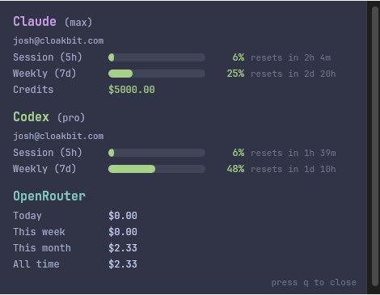

# ai-usage-bar

Lightweight Linux status-bar widget for AI usage limits and spend. Shows Claude, Codex, and OpenRouter at a glance in Waybar, with a click-to-open detailed popup.



## Why use it

- Single compact status icon with worst-case usage across providers
- Click for detailed per-provider cards with bars, resets, spend, and credits
- Auto-recovers stale OAuth sessions for Claude and Codex when possible
- Caches results for 1 hour to avoid unnecessary API calls
- Zero external Go dependencies (stdlib only)

## Quick start

### Requirements

- Linux + Waybar
- `yad` (popup window)
- Go 1.25+

### Install

One-liner:

```bash
curl -fsSL https://raw.githubusercontent.com/jhartzell/ai-usage-bar/main/install.sh | bash
```

Pinned version example:

```bash
curl -fsSL https://raw.githubusercontent.com/jhartzell/ai-usage-bar/main/install.sh | bash -s -- --version v0.1.0
```

Manual build:

```bash
git clone git@github.com:jhartzell/ai-usage-bar.git
cd ai-usage-bar
go build -o ~/.local/bin/ai-usage-bar ./cmd/ai-usage-bar
```

Or with task:

```bash
task install
```

### Provider auth setup

```bash
claude login
codex login
```

If you use OpenRouter, set:

```bash
export OPENROUTER_API_KEY="..."
```

## Waybar setup

Add this module to your Waybar config:

```json
"custom/ai_usage": {
  "exec": "~/.local/bin/ai-usage-bar",
  "return-type": "json",
  "interval": 120,
  "tooltip": false,
  "on-click": "~/.local/bin/ai-usage-bar --detail"
}
```

Add `"custom/ai_usage"` to your module list.

Optional style snippet:

```css
#custom-ai_usage { color: #81c8be; }
#custom-ai_usage.warning { color: #e5c890; }
#custom-ai_usage.critical { color: #e78284; }
```

Optional Sway float rules:

```text
for_window [title="AI Usage"] floating enable
for_window [title="AI Usage"] border pixel 0
```

## How it works

- Default mode prints one JSON line for Waybar (icon + class + percent)
- `--detail` opens a popup with full provider breakdown
- Providers are fetched concurrently with a 5s timeout each
- Results are cached in `~/.cache/ai-usage-bar/cache.json` for 1 hour
- Error results are not reused from cache, so transient failures recover quickly

## Providers

| Provider | Auth source | Data shown |
|---|---|---|
| Claude | `~/.claude/.credentials.json` | Session + weekly usage, extra usage remaining |
| Codex | `~/.codex/auth.json` | Session + weekly usage |
| OpenRouter | `OPENROUTER_API_KEY` | Daily/weekly/monthly/all-time spend, budget remaining |

Missing auth shows `?`. Auth failures show `!`.

## Auth recovery

Claude and Codex tokens are automatically refreshed when possible. If a provider still shows `!`, re-auth and force refresh:

```bash
claude login
codex login
rm ~/.cache/ai-usage-bar/cache.json
~/.local/bin/ai-usage-bar
```

## Commands

```bash
ai-usage-bar          # Waybar JSON output
ai-usage-bar --detail # popup details
```

## Development

```bash
task fmt
task build
task dev
```

## Releases

- Changelog: `CHANGELOG.md`
- GitHub releases: https://github.com/jhartzell/ai-usage-bar/releases

## License

MIT
